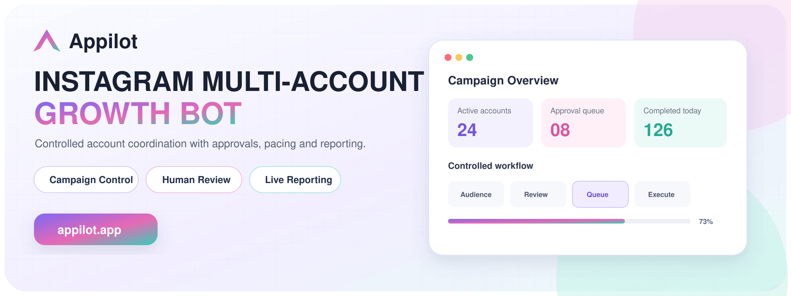
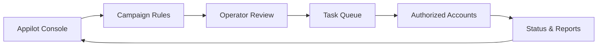
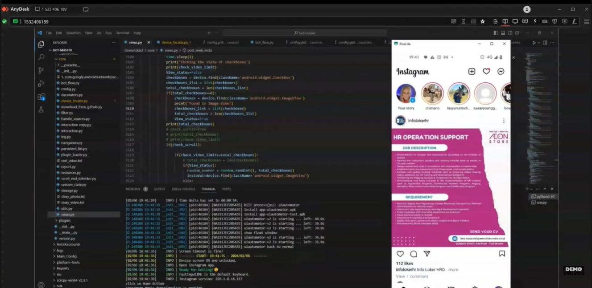
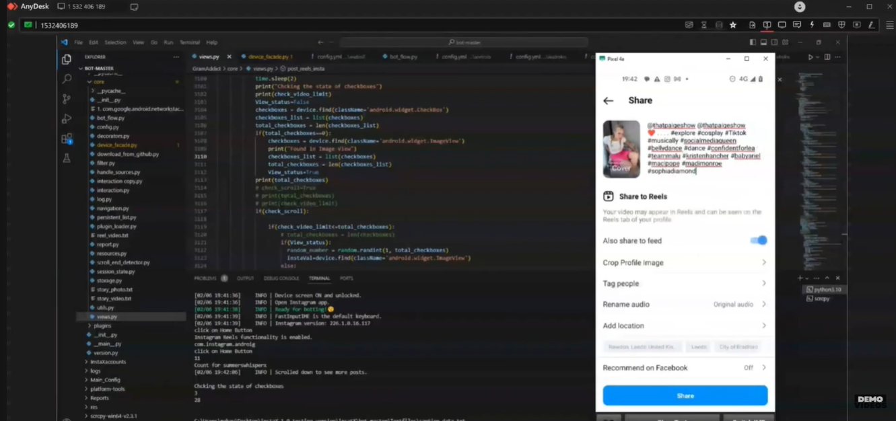
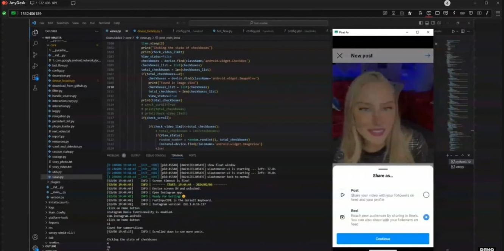

# Instagram Multi-Account Growth Bot

**An Appilot product showcase for coordinating approved outreach and audience-development workflows across authorized Instagram accounts.**

[](https://www.appilot.app/) [](https://youtu.be/32b04e3ekMU)

## Demo Video

[](https://youtu.be/32b04e3ekMU)

**Watch on YouTube:** https://youtu.be/32b04e3ekMU

## Overview

This system gives operators one controlled workspace for coordinating outreach from multiple authorized Instagram accounts. Campaign rules, account assignments, pacing, approvals and activity reporting remain visible from a centralized Appilot workflow.


## Core Capabilities

| Capability | What it provides |
|---|---|
| **Account coordination** | Organizes authorized campaign accounts from one workspace. |
| **Campaign assignments** | Maps approved audience segments and tasks to selected accounts. |
| **Operator approvals** | Keeps sensitive actions subject to human review. |
| **Controlled pacing** | Applies account-level schedules and configurable activity limits. |
| **Session separation** | Maintains independent authenticated account sessions. |
| **Activity reporting** | Records task status, outcomes and operator interventions. |
| **Custom workflows** | Adapts campaign logic to the customer’s approved operating process. |

## Architecture



## Screenshots

<table align="center">
  <tr>
    <td align="center" width="33%"><br><br><b>1.</b> Campaign workflow running beside an Instagram session</td>
    <td align="center" width="33%"><br><br><b>2.</b> Approved sharing step inside the mobile application</td>
    <td align="center" width="33%"><br><br><b>3.</b> Audience selection in an authorized workflow</td>
  </tr>
</table>

## Repository Contents

```text
instagram-multi-account-growth-bot/
├── README.md
├── ARCHITECTURE.md
├── DEMO.md
├── REPOSITORY-SETUP.md
├── RESPONSIBLE-USE.md
├── repo-metadata.json
├── LICENSE
├── .gitignore
└── assets/
    ├── banner.png
    └── screenshots/
```

## Build a Controlled Multi-Account Workflow

Appilot can scope account coordination, human approvals, reporting and campaign controls around your legitimate outreach process.

**[Discuss Your Project With Appilot](https://www.appilot.app/contact)**

[Visit Appilot](https://www.appilot.app/) · [Watch the Demo](https://youtu.be/32b04e3ekMU)

